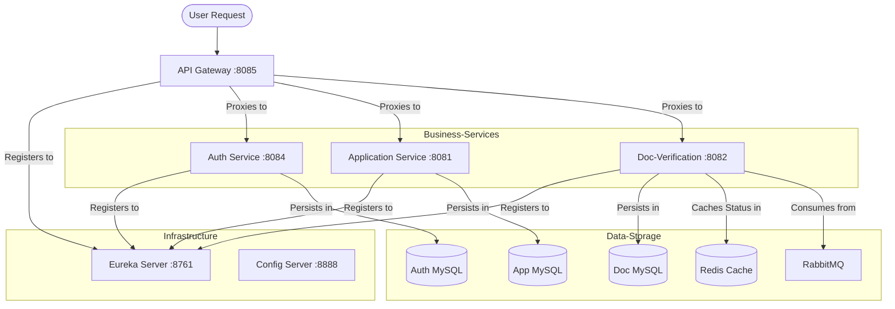

# FinFlow: Microservices System Documentation

## 1. System Overview
FinFlow is a microservices-based financial platform built using **Java 17, Spring Boot 3.x, and Spring Cloud**. It provides capabilities for user authentication, document verification, and loan/application management. The system is designed for high scalability, security, and resilience.

### Architecture Highlights
- **Service Registry**: Eureka Server for dynamic service discovery.
- **API Gateway**: Spring Cloud Gateway for centralized routing, cross-cutting concerns (authentication, CORS), and Swagger UI.
- **Config Management**: Centralized configuration management using Config Server.
- **Security**: JWT-based authentication at the Gateway level and within services.
- **Performance**: Redis caching for document status verification.
- **Asynchronous Communication**: RabbitMQ for decoupling document verification from uploads.
- **Persistence**: MySQL databases for Auth, Applications, and Documents.

## 2. Architecture Diagram

## 3. Module Breakdown

### 🛰️ API Gateway (`:8085`)
- **Main Duty**: Entry point for all external requests.
- **Routing**: Routes `/auth/**` to `auth-service`, `/application/**` and `/admin/**` to `application-service`, and `/documents/**` to `doc-verification`.
- **Security**: Injects a global `X-Gateway-Secret` header to every request it proxies, ensuring only its traffic can reach downstream services.
- **Swagger**: Aggregates API documentation only at this level (as per user request).

### 🔐 Auth Service (`:8084`)
- **Main Duty**: Manage users and security tokens.
- **Tech**: JWT (jjwt 0.11.5), Spring Security, MySQL.
- **Endpoints**: `/auth/signup`, `/auth/login`.
- **Logic**: Encodes passwords using `BCryptPasswordEncoder` and signs JWTs with a secret key.

### 📄 Doc-Verification Service (`:8082`)
- **Main Duty**: Handle file uploads and document state.
- **Caching**: Uses **Redis** (`@Cacheable`, `@CacheEvict`) for high-performance status checks (`/documents/status/{userId}`).
- **Asynchronous**: Integrated with RabbitMQ for event-driven processing.
- **Fixes**: Corrected path routing issues between Gateway and the Controller and fixed Security bypass for Gateway-validated requests.

### 💰 Application Service (`:8081`)
- **Main Duty**: Core business logic for loan applications.
- **Endpoints**: Managing application states, admin approvals, and user-specific views.
- **Registry**: Communicates with Config Server for properties.

## 4. Key Improvements & Features
1. **Swagger Segregation**: Swagger UI and API descriptors are centralized at the API Gateway level. Child services do not expose Swagger themselves ([pom.xml](file:///f:/FinFlow/FinFlow_Capgemini_Sprint/api-gateway/pom.xml) dependencies removed).
2. **Redis Caching**:
   - `spring-boot-starter-data-redis` added.
   - `@EnableCaching` on the application class.
   - `@Cacheable` on [getStatus()](file:///f:/FinFlow/FinFlow_Capgemini_Sprint/doc-verification/src/main/java/com/finflow/demo/controller/DocumentController.java#36-41) and `@CacheEvict` on [upload()](file:///f:/FinFlow/FinFlow_Capgemini_Sprint/doc-verification/src/main/java/com/finflow/demo/controller/DocumentController.java#21-35), [verifyDocument()](file:///f:/FinFlow/FinFlow_Capgemini_Sprint/doc-verification/src/main/java/com/finflow/demo/controller/DocumentController.java#48-53), and [rejectDocument()](file:///f:/FinFlow/FinFlow_Capgemini_Sprint/doc-verification/src/main/java/com/finflow/demo/service/DocumentService.java#132-148).
3. **Robust Testing**:
   - Added JUnit 5 + Mockito tests.
   - Verified [DocumentService](file:///f:/FinFlow/FinFlow_Capgemini_Sprint/doc-verification/src/main/java/com/finflow/demo/service/DocumentService.java#17-149) (caching/logic) and [AuthService](file:///f:/FinFlow/FinFlow_Capgemini_Sprint/auth-service/src/main/java/com/example/demo/service/AuthService.java#15-67) (signup/login/token logic).

---

## 5. Viva Preparation: Comprehensive Q&A

### ☕ Core Java
**Q1: What are the new features in Java 17 (LTS)?**
- Sealed Classes, Records, Pattern Matching for `instanceof`, and Text Blocks.

**Q2: Difference between `Optional.isPresent()` and `Optional.ifPresent()`?**
- `isPresent()` returns a boolean if a value exists; `ifPresent()` executes a Consumer if a value exists.

### 🍃 Spring Boot & Microservices
**Q3: What is the role of Eureka in your project?**
- It’s the Service Discovery component. Services register their network locations at startup so others can find them by service ID rather than hardcoded IPs.

**Q4: How does Spring Cloud Gateway handle security?**
- It can handle Cross-Origin Resource Sharing (CORS), rate limiting, and header manipulation (like injecting our secret key). It validates incoming tokens before routing.

**Q5: What is the benefit of a Config Server?**
- Centralized property management. We can update configurations (like DB passwords or URLs) in one place without re-compiling individual services.

### 🔐 Security & JWT
**Q6: What are the components of a JWT?**
- Header (Algorithm/Type), Payload (Claims/Data), and Signature (Verified with a Secret Key).

**Q7: How did you secure downstream services (behind the Gateway)?**
- We use a "Secret Header Strategy". The Gateway injects `X-Gateway-Secret`. Downstream services have a [Filter](file:///f:/FinFlow/FinFlow_Capgemini_Sprint/doc-verification/src/main/java/com/finflow/demo/security/GatewayValidationFilter.java#19-77) (e.g., [GatewayValidationFilter](file:///f:/FinFlow/FinFlow_Capgemini_Sprint/doc-verification/src/main/java/com/finflow/demo/security/GatewayValidationFilter.java#14-78)) that checks this header. If missing or invalid, it returns `403 Forbidden`.

### ⚡ Databases, Redis & RabbitMQ
**Q8: Why use Redis for document verification status?**
- Because "status checking" is a read-heavy operation. Fetching from Redis (In-Memory) is significantly faster than querying MySQL repeatedly.

**Q9: When should you clear (evict) the Redis cache?**
- Whenever the underlying data changes. In our code, we use `@CacheEvict` whenever a document is uploaded or its status is updated by an admin.

**Q10: What is RabbitMQ used for, and why use it over REST?**
- For async processing. If a task (like PDF parsing or malware scanning) takes time, we should respond to the user immediately and process the task in the background using a message queue.

### 🧪 Unit Testing
**Q11: Difference between `@Mock` and `@InjectMocks`?**
- `@Mock` creates a dummy instance of a dependency. `@InjectMocks` creates the actual class under test and automatically injects the mocked dependencies into it.

**Q12: Why use Mockito in Unit Tests?**
- To isolate the code under test. It allows us to simulate the behavior of databases or external services without needing an actual network connection or database setup.
